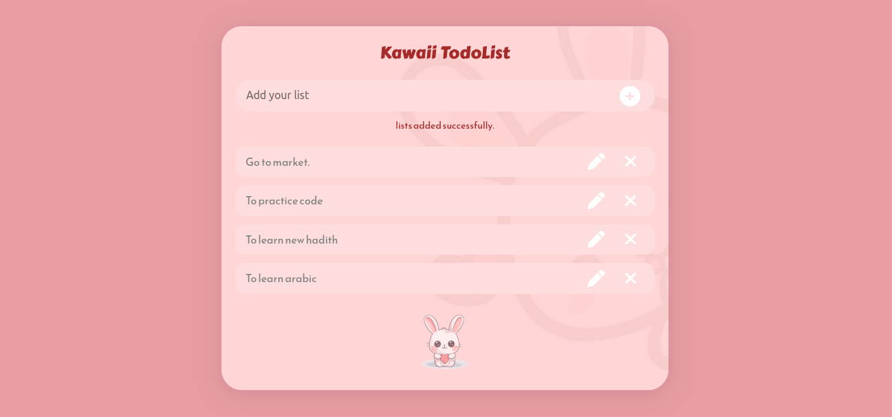
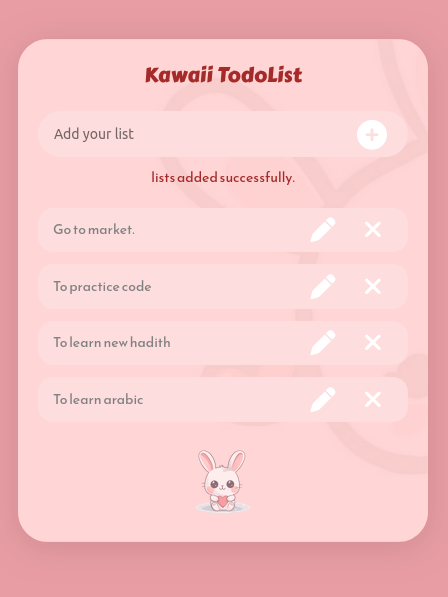

# ASTUMSJ-Bootcamp-D-2

📌 Project Description

This is a static Kawaii-themed ToDo List UI built with HTML and CSS, featuring a soft pastel color scheme and a playful design. It includes a title, input box, and task cards with edit and delete icons, all set against a pink gradient background with a faint bunny image for a cute, relaxing look.

## ⚙️ Challenges

Creating the basic layout with HTML was straightforward, including the heading, input, and task containers. The main challenge was styling details like overlapping the plus button inside the input and keeping consistent colors for each task box.

## 🖼️ Screenshot

